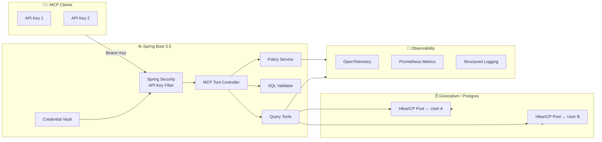

# <div align="center" style="padding:32px 24px;border-radius:28px;background:linear-gradient(135deg,#021627,#123457);border:1px solid rgba(94,207,255,0.35);box-shadow:0 25px 65px rgba(5,12,32,0.45);">🛡️ <span style="color:#74f7ff;">Greenplum MCP Server</span></div>

<div align="center">
  <p style="margin:16px 0 0;font-size:18px;font-weight:500;color:#eaf6ff;">
    Spring Boot · Spring AI MCP · Greenplum/Postgres · Encrypted API key vault · Streamable HTTP tools
  </p>
</div>

<p align="center">
  
  
  
  
  
</p>

---

## 🧭 Table of Contents

1. [Why Teams Use It](#-why-teams-use-it)
2. [Feature Spotlight](#-feature-spotlight)
3. [Front-End Control Center](#-front-end-control-center)
4. [Architecture Map](#-architecture-map)
5. [MCP Tools & APIs](#-mcp-tools--apis)
6. [Run It Now](#-run-it-now)
7. [Configuration Vault](#-configuration-vault)
8. [Observability Radar](#-observability-radar)
9. [Security Stance](#-security-stance)
10. [Development Flow](#-development-flow)
11. [Further Reading](#-further-reading)
12. [License & Credits](#-license--credits)

---

## ✨ Why Teams Use It

- **🔐 Multi-tenant guardrails** — Every API key maps to a distinct Greenplum role with credentials encrypted via AES-256-GCM.
- **🧠 Smart SQL tooling** — Policy-aware query execution, EXPLAIN plans, schema exploration, and cursor streaming through Spring AI MCP.
- **⚡ Ops friendly** — HikariCP per-tenant pools, Prometheus and OpenTelemetry hooks, health endpoints, and structured audit logs out of the box.
- **🧱 Production ready** — Built on Spring Boot 3.5, tested against Greenplum/Postgres targets, and configurable entirely via environment variables.
- **🗝️ Zero-leak posture** — Secrets live in `.env`, the repo ships with templates only, and client guides reference placeholders instead of live values.

---

## 🚀 Feature Spotlight

### 🧰 MCP Toolbelt

| Tool | What You Get | Notes |
|------|---------------|-------|
| `gp.listSchemas` | Explore schemas, tables, and columns | JSON table output with pagination hints |
| `gp.previewQuery` | Validate SQL without running it | Uses JSQLParser + policy engine |
| `gp.runQuery` | Execute parameterized `SELECT` | Streams via JSON Table format |
| `gp.explain` | Produce verbose query plans | Supports `ANALYZE` toggle |
| `gp.openCursor` / `gp.fetchCursor` / `gp.closeCursor` | Server-side cursor lifecycle | Handles large result sets safely |
| `gp.cancel` | Cancel in-flight operations | Routes through connection manager |

### 🧮 Platform Superpowers

- **Per-key pools** — `DatabaseConnectionManager` spins up isolated HikariCP pools so noisy neighbors stay contained.
- **Policy enforcement** — `policy.yml` governs max rows, byte budgets, schema/table allow lists, and redaction rules.
- **SQL inspection** — `SchemaTools` + `JSQLParser` prevent mutations, multi-statements, and disallowed functions.
- **Streaming transport** — Implements the MCP Streamable HTTP spec for responsive LLM tool usage.

---

## 🎨 Front-End Control Center

The admin console at `/admin/api-keys` ships as a polished single-file experience (`src/main/resources/templates/api-keys.html`). It is intentionally framework-light but far from plain.

### UI Stack at a Glance

| Layer | Significant Libraries / APIs | Why It Matters |
|-------|------------------------------|----------------|
| Template Delivery | Spring Boot MVC + Thymeleaf | Serves the HTML shell with zero JavaScript bundling complexity. |
| Styling | Modern CSS (flex/grid, system font stack, `backdrop-filter`, keyframe animations) | Produces the glass-card aesthetic, responsive two-column form layout, and animated spinners. |
| Interactivity | Vanilla JS, `fetch`, async/await, `FormData` helpers | Powers connection testing, API key generation, optimistic status toasts, and dynamic field validation with no dependency weight. |
| UX Flourishes | Emoji iconography, alert color palette, inline copy-safe key reveal | Guides operators to save secrets, highlights failure modes, and keeps the experience friendly. |

### Experience Touches

- **Connection dry-runs** — The "Test Connection" button posts to `/admin/api-keys/test-connection` before any credential is minted.
- **Guarded secrets** — Inline banners warn that generated keys display once; the layout encourages instant copy & storage.
- **Responsive grid** — CSS grid collapses to a single column below 600px for tablet administration on the go.
- **Zero build step** — Everything lives in one HTML file; changes deploy with your next Spring Boot restart.

---

## 🏗️ Architecture Map



---

## 🔌 MCP Tools & APIs

- **Streamable HTTP Endpoint:** `POST /mcp` (configurable via `application.yml`).
- **Admin Console Endpoints:**
  - `POST /admin/api-keys/generate`
  - `POST /admin/api-keys/test-connection`
  - `GET /admin/api-keys` (serves the console)
- **Actuator Surface:** `/actuator/health`, `/actuator/prometheus`, `/actuator/info` for ops integrations.

Pair this server with any MCP-aware client (e.g., LaunchDarkly MCP Inspector, [OpenAI assistants](https://platform.openai.com/assistants), or the sibling [gp-assistant](../gp-assistant)).

---

## ⚙️ Run It Now

```bash
# 1) Clone
git clone https://github.com/dbbaskette/gp-mcp-server.git
cd gp-mcp-server

# 2) Generate an encryption key for API credential storage
openssl rand -base64 32

# 3) Create your .env (never commit this file)
cat > .env <<'ENV'
export DB_URL=jdbc:postgresql://localhost:15432/postgres
export DB_USER=gpadmin
export DB_PASSWORD=your_admin_password
export GP_MCP_ENCRYPTION_KEY=your_generated_encryption_key
export SERVER_PORT=8082
ENV

# 4) Launch
./run.sh            # loads .env, builds if needed, starts Spring Boot
# or
./mvnw clean spring-boot:run
```

Visit `http://localhost:8082/admin/api-keys` to mint keys and `http://localhost:8082/mcp` for MCP traffic.

---

## 🔧 Configuration Vault

| Category | Key | Default | Description |
|----------|-----|---------|-------------|
| Database | `DB_URL` | `jdbc:postgresql://localhost:15432/postgres` | Target Greenplum/Postgres cluster. |
|          | `DB_USER` / `DB_PASSWORD` | `gpadmin` / `secret` | Bootstrap credentials; override in production. |
| Security | `GP_MCP_ENCRYPTION_KEY` | _(required)_ | Base64-encoded 32-byte key protecting stored credentials. |
|          | `API_KEY_ENABLED` | `true` | Toggle API key enforcement for local experiments. |
| Policy   | `POLICY_PATH` | `classpath:policy.yml` | Master policy file for schema/table limits. |
|          | `DB_SEARCH_PATH` | `public` | Default search path applied per session. |
|          | `DB_STATEMENT_TIMEOUT_MS` | `5000` | Query timeout guardrail (ms). |
| MCP      | `SERVER_PORT` | `8082` | HTTP port for the service. |
|          | `ENVIRONMENT` | `development` | Injected into metrics tags. |
| Telemetry | `OTEL_EXPORTER_OTLP_ENDPOINT` | `http://localhost:4317` | OpenTelemetry collector endpoint. |

Full matrix lives in `src/main/resources/application.yml`.

---

## 📡 Observability Radar

- **Metrics:** Scrape `/actuator/prometheus` for `gp_mcp_query_executions_total`, `gp_mcp_query_duration_seconds`, and per-pool Hikari stats (`hikaricp_connections_active`).
- **Tracing:** OpenTelemetry spans track authentication, policy evaluation, SQL execution, and cursor lifecycle events.
- **Logging:** Structured patterns emitted to console and `logs/gp-mcp-server.log`; include trace/span IDs when tracing is enabled.
- **Health:** `/actuator/health` (overall) and `/actuator/health/db` (database connectivity) integrate cleanly with uptime checks.

---

## 🔐 Security Stance

1. **API Key Auth** — Spring Security filter verifies every call, binding requests to encrypted credential bundles.
2. **Credential Vault** — AES-256-GCM via `EncryptionService` stores usernames/passwords; keys never rest in plaintext.
3. **Greenplum RBAC** — Authorization delegated to database roles; application-level allow lists remain optional.
4. **SQL Guardrails** — JSQLParser validation, parameter binding, read-only enforcement, redaction rules, and cancellation hooks.
5. **Operational Hygiene** — `.env` git-ignored, secrets templated in documentation, and `SECURITY_COMPLIANCE_REPORT.md` captures review evidence.

Rotate any placeholder secrets you copied from older docs; historic values should be considered compromised.

---

## 🧰 Development Flow

```bash
# Install dependencies & build
./mvnw clean compile

# Run unit tests
./mvnw test

# Launch with live reload (DevTools)
./mvnw spring-boot:run

# Format / lint hooks (if configured later)
./mvnw spotless:apply
```

Recommended next steps:
- Add a GitHub Actions workflow running the build + tests on pull requests.
- Wire the MCP endpoint into `gp-assistant` or another client for end-to-end smoke tests.
- Extend the admin console with audit history for key issuance.

---

## 📚 Further Reading

- [`MCP_CLIENT_CONFIG.md`](MCP_CLIENT_CONFIG.md) — Client configuration patterns and inspector examples.
- [`API_KEY_GUIDE.md`](API_KEY_GUIDE.md) — Credential rotation, expiry, and policy guardrails.
- [`SECURITY_COMPLIANCE_REPORT.md`](SECURITY_COMPLIANCE_REPORT.md) — Current security posture snapshot.
- [Spring AI MCP Overview](https://docs.spring.io/spring-ai/reference/1.1-SNAPSHOT/api/mcp/mcp-overview.html)
- [Greenplum Documentation](https://greenplum.org/docs/)

---

## 🪪 License & Credits

Licensed under the [MIT License](LICENSE).

Huge thanks to:
- [Spring Boot](https://spring.io/projects/spring-boot) & [Spring AI](https://spring.io/projects/spring-ai) for the MCP server foundation.
- [Greenplum Database](https://greenplum.org/) for the massively parallel SQL core.
- [OpenTelemetry](https://opentelemetry.io/) and [Micrometer](https://micrometer.io/) for observability tooling.

<p align="center" style="font-size:14px;color:#8f9fff;margin-top:32px;">
Crafted with 💙 to give every LLM a safe window into Greenplum.
</p>
