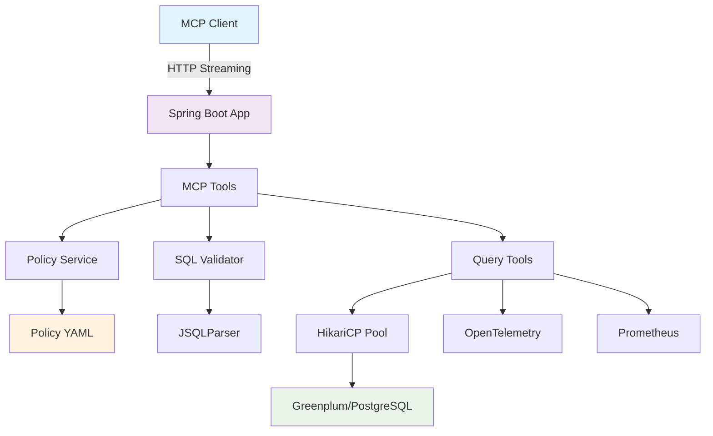

# 🚀 Greenplum MCP Server

<div align="center">


**Safe Query Tools for Greenplum/PostgreSQL via Model Context Protocol**

[](LICENSE)
[]()

</div>

## 📋 Table of Contents

- [🎯 Overview](#-overview)
- [✨ Features](#-features)
- [🏗️ Architecture](#️-architecture)
- [🚀 Quick Start](#-quick-start)
- [🔧 Configuration](#-configuration)
- [🛠️ MCP Tools](#️-mcp-tools)
- [🔒 Security](#-security)
- [📊 Monitoring](#-monitoring)
- [🧪 Testing](#-testing)
- [📚 Documentation](#-documentation)

## 🎯 Overview

The **Greenplum MCP Server** is a production-ready Spring Boot application that exposes safe query tools for Greenplum and PostgreSQL databases via the Model Context Protocol (MCP). It provides secure, policy-enforced access to database schemas and query execution capabilities through a Streamable-HTTP transport.

### 🎪 Key Capabilities

- **🔍 Schema Discovery**: Browse schemas, tables, and columns with pagination
- **🔒 Safe Query Execution**: Parameterized SELECT queries with policy enforcement
- **📊 Query Analysis**: EXPLAIN plans and query validation
- **🌊 Streaming Support**: Server-side cursors and streaming results
- **⚡ Performance**: Optimized for large datasets with connection pooling
- **🛡️ Security**: Read-only access, SQL injection prevention, data redaction

## ✨ Features

### 🛠️ MCP Tools

| Tool | Description | Features |
|------|-------------|----------|
| `gp.listSchemas` | List database schemas with tables/columns | Pagination, filtering |
| `gp.previewQuery` | Validate queries without execution | Plan estimation, validation |
| `gp.runQuery` | Execute parameterized SELECT queries | Streaming, limits, redaction |
| `gp.explain` | Get detailed query execution plans | JSON format, ANALYZE support |
| `gp.openCursor` | Open server-side cursors | Large result sets |
| `gp.fetchCursor` | Fetch rows from cursors | Batch processing |
| `gp.closeCursor` | Close cursors and free resources | Resource management |
| `gp.cancel` | Cancel running queries | Operation control |

### 🔒 Security Features

- **Policy-Based Access Control**: YAML-configurable schema/table/column permissions
- **SQL Injection Prevention**: Parameterized queries only, SQL parsing validation
- **Data Redaction**: Configurable masking/hashing for sensitive columns
- **Resource Limits**: Row count, byte size, and timeout enforcement
- **Read-Only Access**: Blocks all non-SELECT statements
- **Multi-Statement Prevention**: Rejects queries with multiple statements

### 📊 Observability

- **OpenTelemetry Tracing**: Distributed tracing for query operations
- **Prometheus Metrics**: Query performance and resource usage metrics
- **Structured Logging**: JSON audit logs with security considerations
- **Health Checks**: Database connectivity and service health monitoring

## 🏗️ Architecture



### 🏛️ Component Architecture

- **MCP Server**: Spring AI MCP annotations for tool registration
- **Policy Service**: YAML-based security policy enforcement
- **SQL Validator**: JSQLParser-based query validation
- **Query Tools**: Safe query execution with streaming support
- **Database Config**: HikariCP connection pooling with security settings

## 🚀 Quick Start

### 📋 Prerequisites

- **Java 21+**
- **Maven 3.8+**
- **Greenplum/PostgreSQL** database
- **OpenAI API Key** (for MCP client testing)

### 🔧 Environment Setup

```bash
# Clone the repository
git clone https://github.com/dbbaskette/gp-mcp-server.git
cd gp-mcp-server

# Set environment variables
export DB_URL="jdbc:postgresql://localhost:5432/gpdb"
export DB_USER="gpuser"
export DB_PASSWORD="secret"
export DB_SEARCH_PATH="public"
export DB_STATEMENT_TIMEOUT_MS="5000"
```

### 🏃‍♂️ Running the Server

```bash
# Build and run
./mvnw clean spring-boot:run

# Or with specific profile
./mvnw spring-boot:run -Dspring-boot.run.profiles=development
```

### 🧪 Testing with MCP Client

```bash
# Example MCP client configuration
{
  "mcpServers": {
    "gp-mcp-server": {
      "command": "curl",
      "args": ["-X", "POST", "http://localhost:8080/mcp/tools/gp.listSchemas"]
    }
  }
}
```

## 🔧 Configuration

### 📄 Application Configuration (`application.yml`)

```yaml
spring:
  datasource:
    url: ${DB_URL:jdbc:postgresql://localhost:5432/gpdb}
    username: ${DB_USER:gpuser}
    password: ${DB_PASSWORD:secret}

gp:
  mcp:
    search-path: ${DB_SEARCH_PATH:public}
    statement-timeout-ms: ${DB_STATEMENT_TIMEOUT_MS:5000}
    policy:
      max-rows: 10000
      max-bytes-mb: 100
```

### 🔒 Security Policy (`policy.yml`)

```yaml
allowed-schemas:
  - public
  - information_schema

allowed-tables:
  - public.*

redaction-rules:
  "public.users.email":
    type: MASK
    replacement: "***@***.***"
```

### 🌍 Environment Variables

| Variable | Description | Default |
|----------|-------------|---------|
| `DB_URL` | Database connection URL | `jdbc:postgresql://localhost:5432/gpdb` |
| `DB_USER` | Database username | `gpuser` |
| `DB_PASSWORD` | Database password | `secret` |
| `DB_SEARCH_PATH` | Default search path | `public` |
| `DB_STATEMENT_TIMEOUT_MS` | Query timeout (ms) | `5000` |
| `OTEL_EXPORTER_OTLP_ENDPOINT` | OpenTelemetry endpoint | `http://localhost:4317` |

## 🛠️ MCP Tools

### 📊 Schema Discovery

```json
{
  "tool": "gp.listSchemas",
  "parameters": {
    "limit": 50,
    "offset": 0,
    "includeTables": true,
    "includeColumns": false
  }
}
```

### 🔍 Query Preview

```json
{
  "tool": "gp.previewQuery",
  "parameters": {
    "sqlTemplate": "SELECT * FROM users WHERE id = :id",
    "params": {"id": 123}
  }
}
```

### ⚡ Query Execution

```json
{
  "tool": "gp.runQuery",
  "parameters": {
    "sqlTemplate": "SELECT name, email FROM users WHERE active = :active",
    "params": {"active": true},
    "maxRows": 1000,
    "stream": true
  }
}
```

### 📈 Query Analysis

```json
{
  "tool": "gp.explain",
  "parameters": {
    "sqlTemplate": "SELECT * FROM users WHERE created_at > :date",
    "params": {"date": "2024-01-01"},
    "analyze": false
  }
}
```

## 🔒 Security

### 🛡️ Access Control

The server enforces multi-layer security:

1. **Schema-Level**: Only allowed schemas are accessible
2. **Table-Level**: Wildcard or specific table permissions
3. **Column-Level**: Fine-grained column access control
4. **Query-Level**: SQL parsing and validation

### 🔐 Data Protection

- **Parameterized Queries**: Prevents SQL injection
- **Data Redaction**: Masks sensitive information
- **Resource Limits**: Prevents resource exhaustion
- **Read-Only**: Blocks all modification operations

### 📋 Security Checklist

- ✅ SQL injection prevention
- ✅ Parameterized queries only
- ✅ Multi-statement blocking
- ✅ Dangerous function blocking
- ✅ Resource limit enforcement
- ✅ Data redaction support
- ✅ Audit logging
- ✅ Connection security

## 📊 Monitoring

### 📈 Metrics

Access Prometheus metrics at `/actuator/prometheus`:

```bash
# Query execution metrics
gp_mcp_query_executions_total
gp_mcp_query_duration_seconds

# Schema discovery metrics
gp_mcp_schema_queries_total
gp_mcp_schema_query_duration_seconds
```

### 🔍 Health Checks

```bash
# Service health
curl http://localhost:8080/actuator/health

# Database connectivity
curl http://localhost:8080/actuator/health/db
```

### 📊 Tracing

OpenTelemetry traces are automatically generated for:
- Query execution spans
- Database connection spans
- Policy validation spans
- Error handling spans

## 🧪 Testing

### 🏃‍♂️ Running Tests

```bash
# Run all tests
./mvnw test

# Run with coverage
./mvnw test jacoco:report

# Integration tests
./mvnw test -Dtest=*IntegrationTest
```

### 🧪 Test Categories

- **Unit Tests**: Policy validation, SQL parsing
- **Integration Tests**: Database connectivity, query execution
- **Security Tests**: SQL injection prevention, access control
- **Performance Tests**: Large dataset handling, streaming

## 📚 Documentation

### 📖 Additional Resources

- [Spring AI MCP Documentation](https://docs.spring.io/spring-ai/reference/1.1-SNAPSHOT/api/mcp/mcp-overview.html)
- [Greenplum Documentation](https://greenplum.org/docs/)
- [JSQLParser Documentation](https://github.com/JSQLParser/JSqlParser)
- [OpenTelemetry Documentation](https://opentelemetry.io/docs/)

### 🤝 Contributing

1. Fork the repository
2. Create a feature branch
3. Make your changes
4. Add tests
5. Submit a pull request

### 📄 License

This project is licensed under the MIT License - see the [LICENSE](LICENSE) file for details.

---

<div align="center">

**Built with ❤️ using Spring Boot, Spring AI, and Greenplum**

[Report Bug](https://github.com/dbbaskette/gp-mcp-server/issues) · [Request Feature](https://github.com/dbbaskette/gp-mcp-server/issues) · [Documentation](https://github.com/dbbaskette/gp-mcp-server/wiki)

</div>
